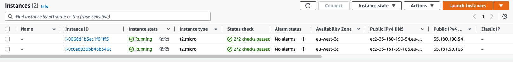
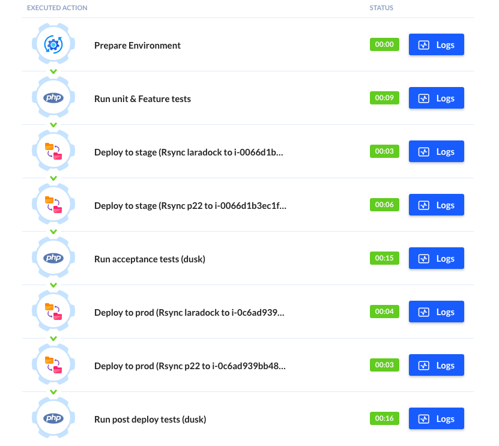

# CI/CD

Prepared 2 EC2 instances on AWS.



Tests are located in the `p22/tests` directory. 
**Unit**, **Feature** and **Browser** tests. 

Unit test is just a sample assertion `p22/tests/Unit/PspTest.php`

Feature test `p22/tests/Feature/RouterTest.php` creates a sample transaction. \
Feature test `p22/tests/Feature/DatabaseTest.php` check DB connection. It's some kind of an integration test. 

Browser test `p22/tests/Browser/TransactionsTest.php` browses to the `transactions` page and checks the title. This test is used for both `acceptance` and `post deploy` tests. 

## Buddy.works actions config

### Unit and feature testing step

```shell
cd p22
cp .env.example .env
composer validate
composer install
php artisan key:generate
vendor/bin/phpunit 
```
also this step has a database service configured. DB is provisioned using the prepared database dump. 


### Deployments

Deployment steps are implemented using the rsync action. Laradock and the application directories are uploaded using separate actions.


### Acceptance and post-deploy steps

Acceptance and post-deploy tests are run with the Laravel artisan dusk command. 
Should be executed separately on stage and prod entities, for homework I used the balancer URL

```shell
cd p22
composer validate
composer install
php artisan dusk:chrome-driver
HOST_NAME=$(hostname -I | tr -d ' ') && sed -i "s/localhost/p23-balancer-1328888491.eu-west-3.elb.amazonaws.com/g" .env 
script -c "php artisan dusk" -eq
```

Acceptance and post-deploy tests steps has selenium service configured


## Result

